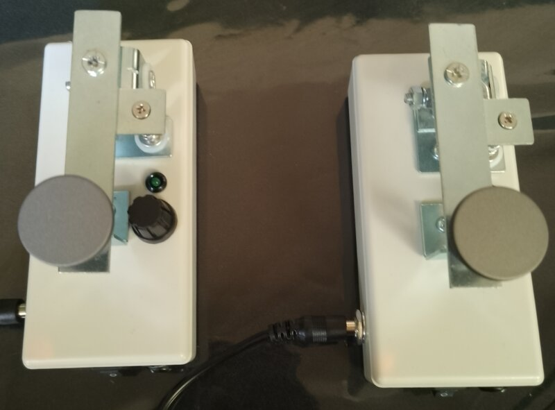
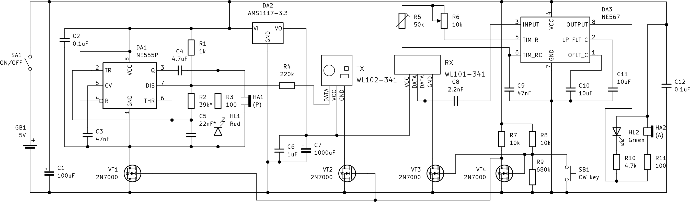
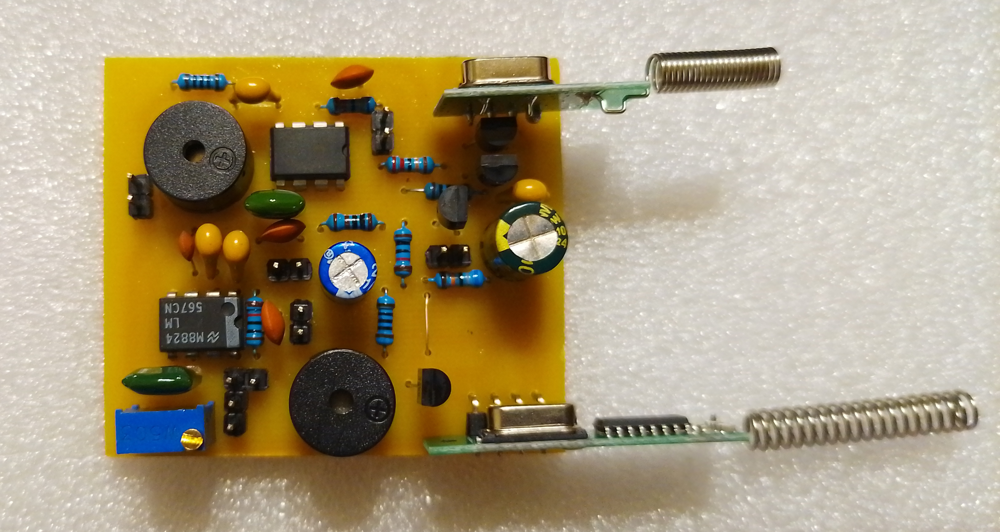
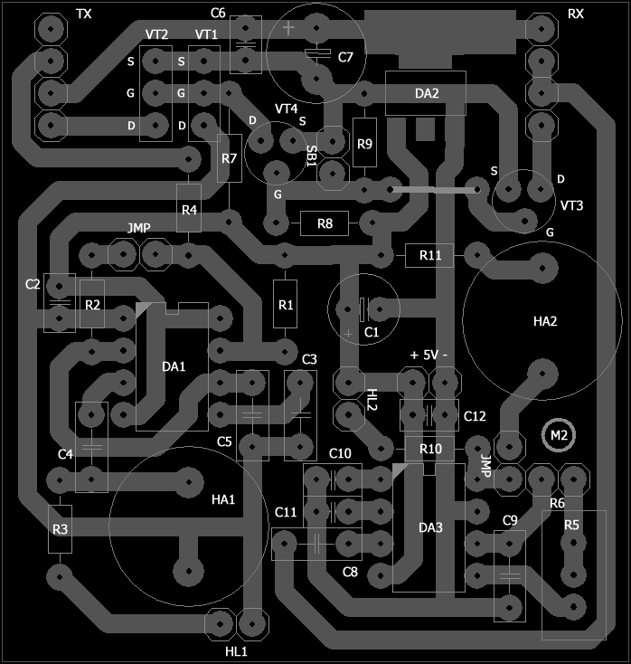

# morse-transceiver
## Wireless Morse code half-duplex transceiver

During my teaching practice along with radio communications theory I need some tools to show my students how it work in a real life. So I made a simple and cheap wireless Morse code transiever for practical studies. It incudes receiver module WL101-341, transmitter module WL102-341, some additional components and works just out of the box after soldering, without programming, Arduinos, MCUs etc. As a power source I use USB power bank to keep transceiver size as small as possible.

Lets take a look at a principal circuit. Beside RX and TX modules I use good'n old NE555 as a square wave tone generator and oldish NE567, which was widely used as DTMF tone decoder in a previous century. WL101-341 and WL102-341 modules are used mostly in a digital circuitry for IoT communication, but here, as you can see,  both were used in a non-standard way.

All tech folks know that NE555 has some disadvantages, such as unwanted oscilations on a power rails, so when we connect any small signal amplifier along with a NE555 we can hear the square wave modulated noise produced by the chip. In our case this is somewhat good news — TX going to be slightly modulated by NE555 LF tone in a very similar way as amplitude modulation does, but also TX produces noise and harmonics, becasue it's an abnormal operation mode for module. So to stabilize oscillation regime we need to add some negative feedback, connecting R4 between data pin of TX and voltage divider R1R2. Via R1 data pin connected to a (+) rail, so it powers up an internal UHF oscillator; via R2 data pin connected to NE555 trigger pin, which internally linked to a differential amplifier and acts like inverting input of a generic opamp (see pic below), compensating parasitic oscillations and harmonics. This simple trick gives surprisingly good results, so we've got almost clean ASK modulation from transmitter module.

Lets see how RX works. It's a superheterodyne receiver with an internal AGC and comparator on data pin (see IEEE classic superhet diagram below).

RX is super sensitivie so this seems like good news. But bad news following immediately: module turs off an AGC when input signal is missing or too weak to recipee. Thus we have fluctuation noise on data pin when transmitter is absent or turned off. What we gonna do next? Of course, we gonna put bandpass filter to attenuate unwanted noise. It can be done with a classic opamp BPF, but NE567 works way better than the Butterworth or Chebyshev 3rd order BPF and much simpler with 2-3 additional components.

VT1, VT2 and VT3 operate like an electronic relay, VT4 is a signal invertor, so when CW key is ON, the TX connected and RX is disconnected from power rail (-) and vice versa. R5 and R6 used to tune up NE567. I highly recommend to use different values of R2C5 for two transceivers.
HL1 connected in the opposite way lit up by HA1 self-induction. All components soldered on 50x55mm PCB.
The transceiver range is about 100m outdoors and about 30m indoors.

